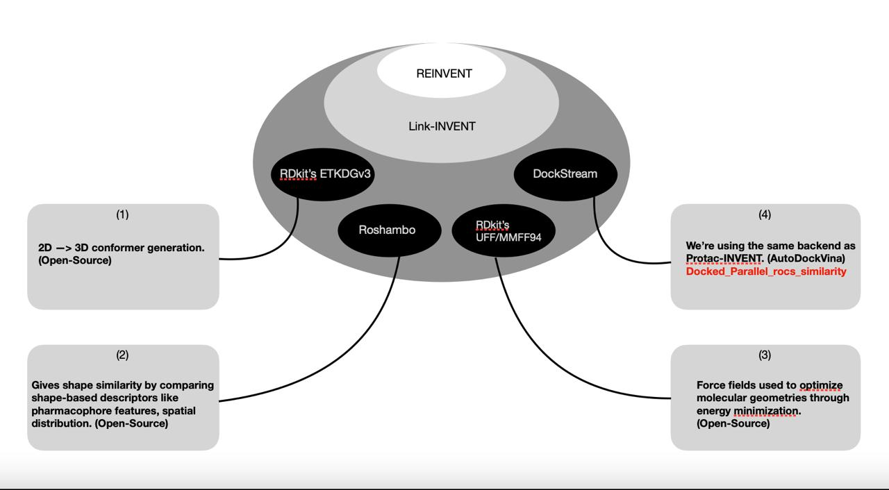
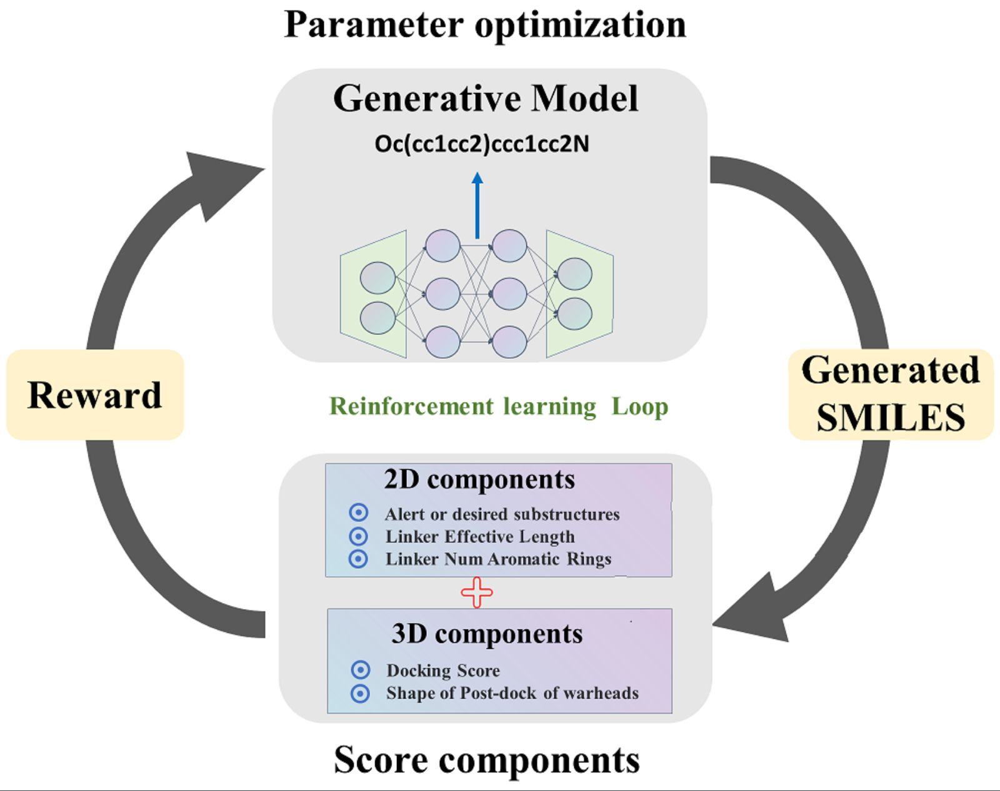

# Open-Protac-INVENT

## Project Description
Source code for our paper "---". This adaptation is built on top of Protac-invent (https://github.com/jidushanbojue/Protac-invent), which itself is based on REINVENT (https://github.com/MolecularAI/Reinvent) and DockStream (https://github.com/MolecularAI/DockStream). 


This adaptation also integrates Roshambo (https://github.com/molecularinformatics/roshambo) to enable shape-based scoring functionality. We thank the original authors of all these projects for sharing their work.


## Diagrams

*Figure 1: Initial Integration Diagram (To be updated)*

  
*Figure 2: General workflow of Open-Protac-INVENT. Adapted from [Protac-invent](https://github.com/jidushanbojue/Protac-invent) under [Apache 2.0 License](https://www.apache.org/licenses/LICENSE-2.0).*


## Installation

### 1. Prerequisites
- Install [Conda](https://docs.conda.io/en/latest/miniconda.html) 
- Ensure `git` is installed and available in your PATH.


### 2. Clone This Repository
```bash
$ git clone https://github.com/SaiCharithReddy/Open-Protac-INVENT.git
$ cd Open-Protac-INVENT
```

### 3. Open terminal, navigate to the cloned repository, and create the Conda environment
```bash
$ conda env create -f environment.yml
```

### 4. Activate the Environment
```bash
$ conda activate open-protac-invent
```

### 5. Install This Repo
```bash
$ pip install -e .
```

## Usage
### 1. Edit the Template JSON
- Locate the template JSON file (for example: results/LINK_invent/BTK/template.json).
- Modify the **file and folder paths** in the template as needed.
- Other parameters can remain unchanged for a standard run.

### 2. Run the Model
Execute the following command to start the run using the edited JSON:
```bash
$ python input.py template.json
```

## License & Attribution

This project is licensed under the **Apache License 2.0**, except where otherwise noted.

Portions of the code, specifically under `src/roshambo/`, are derived from [Roshambo](https://github.com/molecularinformatics/roshambo) and are licensed under the **GNU General Public License v3.0 (GPL-3.0)**.  
Modifications were made to integrate Roshambo into this project. Users must comply with both licenses where applicable.

Full license details can be found in the [LICENSE](./LICENSE) file.  
For the GPL-3.0 portion, see [src/roshambo/LICENSE](./src/roshambo/LICENSE).

We also acknowledge upstream work:
- [Protac-Invent](https://github.com/jidushanbojue/Protac-invent)
- [reinvent-scoring](https://github.com/MolecularAI/reinvent-scoring)
- [DockStream](https://github.com/MolecularAI/DockStream)

